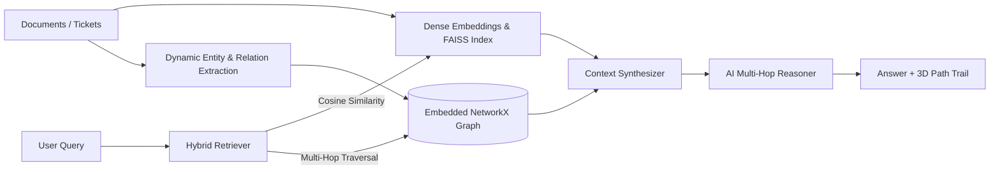

# AI Vector Space Visualization Platform

A production-quality 3D platform for uploading, analyzing, clustering, and visualizing high-dimensional vector spaces.

## Key Features
- **3D Visualization**: OrbitControls, Grid and Coordinate helper axes, and custom shaders/instancedMesh rendering supporting 100k+ data points.
- **Embedded Graph RAG (Knowledge Graph + Vector DB)**: In-memory `NetworkX` graph engine integrated with `FAISS` vector search. Extracts schema-free `(Subject, Relation, Object)` semantic triples and multi-hop paths without external graph databases.
- **3D Relational Edges & Multi-Hop Path Glow**: Renders 3D relationship curves across data points in Three.js and animates active AI reasoning chains with a glowing neon trail.
- **Dimensionality Reduction**: PCA, t-SNE, and UMAP algorithms.
- **Automatic Clustering**: Ingested vectors are partitioned into clusters automatically upon loading using KMeans/HDBSCAN/DBSCAN, dynamically color-mapping the 3D space and dashboard metrics.
- **Community Detection & Global Summarization**: Detects topological communities in the graph and synthesizes macro-level executive summaries (Microsoft GraphRAG style).
- **Similarity Search**: Cosine similarity search using backend FAISS indices to perform real-time nearest neighbor retrieval and highlight links.
- **AI Graph RAG Chatbot**: Interactive chat log using LangChain (Groq Llama 3.3 / GPT-OSS 120B & Gemini) with selectable RAG modes (`Hybrid Graph`, `Vector Only`, `Global Summary`).
- **Knowledge Graph Inspector**: Dedicated inspector tab displaying node/edge metrics, graph density, central hub entities, and relation distributions.
- **Dockable Workspace Guide**: Responsive capability guide that can be docked side-by-side next to the 3D scene or viewed fullscreen, toggleable via a header toolbar button.
- **Self-Contained Data Exchange**: Export and import vector datasets alongside their embedding metadata (provider, model, dimensions), recreating the FAISS index without regenerating vectors.
- **Analytics**: Hand-drawn dashboard graphs showing cluster/severity percentages and metrics (average similarity, outliers).
- **AI Text Ingestion & Excel/CSV Parsing**: On-the-fly vectorization of raw text. Supports newline-separated lists, structured `Number - Text` rows, or standard Excel (`.xlsx`/`.xls`) and CSV uploads.

---

## Folder Structure
```
vector-space-platform/
├── docker-compose.yml
├── README.md
├── backend/
│   ├── Dockerfile
│   ├── requirements.txt
│   ├── .model_cache/                     # Local persistent cache for offline SentenceTransformers
│   ├── sample_data/
│   │   ├── sample_ingest_data.csv
│   │   ├── sample_ingest_data.xlsx
│   │   └── servicenow_incidents_sample.xlsx
│   └── app/
│       ├── main.py                       # FastAPI application & REST routing
│       ├── graph.py                      # NetworkX Embedded Knowledge Graph engine
│       ├── graph_rag.py                  # Hybrid Graph RAG, triple extraction & multi-hop reasoner
│       ├── store.py                      # Re-entrant in-memory vector & graph synchronized store
│       ├── embeddings.py                 # Multi-provider embeddings & offline disk cache loader
│       ├── reduction.py                  # PCA, t-SNE, and UMAP dimensionality reduction
│       ├── clustering.py                 # KMeans, HDBSCAN, and DBSCAN clustering
│       ├── similarity.py                 # FAISS & NumPy vectorized cosine/euclidean search
│       ├── chat.py                       # LangChain Groq / Gemini Graph RAG chat copilot
│       └── models.py                     # Pydantic data schemas
└── frontend/
    ├── Dockerfile
    ├── nginx.conf
    ├── index.html
    ├── package.json
    └── src/
        ├── App.jsx
        ├── api/client.js                 # Axios API client with Graph RAG endpoints
        ├── context/AppContext.jsx        # Global state with Graph topology & RAG mode
        └── components/
            ├── Visualization/
            │   ├── Scene.jsx             # Three.js 3D Coordinate Canvas
            │   ├── PointCloud.jsx        # InstancedMesh point cloud renderer
            │   ├── GraphConnectionLines.jsx # 3D Knowledge Graph relational edges & path trails
            │   ├── ConnectionLines.jsx   # Nearest neighbor similarity links
            │   └── ChatConnectionLines.jsx # Active context reference links
            ├── Details/
            │   ├── AIChatPanel.jsx       # Graph RAG AI Assistant with multi-hop citations
            │   ├── GraphInspectorPanel.jsx # Dedicated Knowledge Graph topology inspector
            │   └── VectorDetails.jsx     # Selected node metadata & properties
            └── Layout/
                ├── RightPanel.jsx        # Multi-tab sidebar (Details, Matches, Stats, Chat, Graph)
                └── TopBar.jsx            # Action toolbar
```


---

## Getting Started

### Method 1: Using Docker Compose (Recommended)
Make sure you have Docker installed, then run:
```bash
docker compose up --build
```
- Frontend will be available at: [http://localhost:3000](http://localhost:3000)
- Backend will be available at: [http://localhost:8000](http://localhost:8000)

### Method 2: Local Development Setup

#### Backend Setup
1. Navigate to the backend directory:
   ```bash
   cd backend
   ```
2. Create and activate a Python virtual environment:
   ```bash
   python -m venv venv
   # On Windows:
   venv\Scripts\activate
   # On Unix:
   source venv/bin/activate
   ```
3. Install the dependencies:
   ```bash
   pip install -r requirements.txt
   ```
4. Run the FastAPI development server:
   ```bash
   uvicorn app.main:app --host 127.0.0.1 --port 8000 --reload
   ```

#### Frontend Setup
1. Navigate to the frontend directory:
   ```bash
   cd frontend
   ```
2. Install Node.js dependencies:
   ```bash
   npm install
   ```
3. Launch the Vite development server:
   ```bash
   npm run dev
   ```
   The local dev server runs on [http://localhost:5173](http://localhost:5173) and proxies `/api/*` requests to the local backend.

---

## File Format Specs

### Pre-computed Vector Files
If you already have embeddings computed:
- **JSON Format**:
  ```json
  [
    {
      "id": "alert_0001",
      "label": "CPU Spike",
      "embedding": [0.23, 0.45, 0.67, 0.12, 0.05, -0.11, 0.89, -0.45, 0.22, 0.11, 0.03, -0.21, 0.33, 0.14, 0.99, -0.87, 0.12, 0.02, 0.45, 0.66, -0.12, 0.02, 0.33, -0.19, 0.45, 0.12, -0.09, 0.88, 0.12, -0.11, 0.02, 0.15],
      "metadata": { "severity": "Critical", "source": "Azure Monitor", "service": "web-frontend", "timestamp": "2026-06-20T10:00:00Z" }
    }
  ]
  ```
- **CSV Format**:
  - *Wide Format*: Columns named `dim_0`, `dim_1`, ..., `dim_N` with additional metadata columns `id`, `label`, `severity`, `source`, `service`, `timestamp`.
  - *Stringified Embedding*: A column named `embedding` containing the JSON array as a string, e.g., `"[0.23, 0.45, 0.67]"` along with other metadata fields.

### AI Text Ingestion (Embeddings generated on-the-fly)
When using the **AI Text Vectorization** panel, you can import data via three inputs:
1. **Simple List**: Plain text strings entered in the text box (one document per line).
2. **Pasted Text (Structured)**: Text lines following the `Number - Text` format (e.g. `1 - Database migration completed`).
3. **Excel or CSV File Ingestion**: Upload a spreadsheet containing at least two columns matching `Number` and `Text` (searched case-insensitively, e.g. `Number`/`ID` and `Text`/`Content`).

---

## Embedding Provider Configuration

The platform supports multiple AI text vectorization providers which can be chosen interactively in the frontend.

### Provider Details
1. **Gemini (Cloud API)**:
   - Model: `gemini-embedding-001` (768 dimensions)
   - Configuration: Read from the `GEMINI_API_KEY` environment variable.
   - Optimization: Employs batch processing, automatic input cleaning, and exponential backoff retry mechanisms to handle 429 rate limits.
   - Platform Limit: Enforces a strict quota limit of 100 records per upload to prevent Google Cloud free-tier quota exhaustion.
2. **Sentence Transformers (Local Fallback & Offline Engine)**:
   - Model: `all-MiniLM-L6-v2` (384 dimensions)
   - Persistent Local Disk Cache: Model weights are cached locally inside `backend/.model_cache/`.
   - Instant Offline Startup (< 0.5s): Automatically loads from local disk with `local_files_only=True` to eliminate redundant Hugging Face Hub downloads and network latency.
3. **Hugging Face (Cloud API)**:
   - Integration: Utilizes LangChain (`langchain-huggingface`) to call Hugging Face Inference API models.
   - Model: Default is `sentence-transformers/all-MiniLM-L6-v2` (384 dimensions), but can be customized.
   - Configuration: Authenticates using the `HF_TOKEN` or `HUGGINGFACEHUB_API_TOKEN` environment variables.
4. **OpenAI (Cloud API)** & **Azure OpenAI**:
   - Provide credentials directly in the frontend panel (never stored).

### Hybrid Embedding Strategy
To guarantee platform resilience, if the primary **Gemini** cloud embedding generation fails (e.g., due to network issues, bad keys, or quota issues after retries), the backend automatically implements a **local fallback strategy** to generate embeddings using the local Sentence Transformers model.

### Environment & Diagnostics
- **Startup Diagnostics**: The backend executes configuration checks and diagnostic runs on startup, reporting selected default providers and logging state info.
- **Diagnostic Endpoint**: Run `GET http://localhost:8000/embedding-diagnostic` to inspect API configuration, masked environment key setups, and resolved `.env` configurations.
- **Dotenv Loading**: Searches and loads `.env` configurations from the immediate working directory, parent `backend/` directory, and the project root directory recursively.

---

## Graph RAG & Knowledge Graph Architecture

The platform features an embedded **Hybrid Graph RAG** engine that combines dense vector retrieval (`FAISS`) with an in-memory topological Knowledge Graph (`NetworkX`):



### Graph RAG Modes:
1. **Hybrid Graph RAG**: Combines top-k dense vector matches with 1–2 hop subgraph traversal, extracting connecting paths across entities and feeding structured triples to the LLM.
2. **Vector Only**: Standard dense similarity retrieval via FAISS/NumPy.
3. **Global Summary (Community RAG)**: Groups entities into topological communities using modularity optimization and synthesizes high-level summaries across thematic clusters.

### Graph API Endpoints:
- `GET /graph/data`: Returns full graph topology (nodes, edges, communities, metrics).
- `POST /graph/build`: Rebuilds the in-memory knowledge graph using `hybrid`, `heuristic`, or `llm` mode.
- `POST /graph/extract-triples`: Extracts entity-relation triples from raw text.
- `POST /graph/subgraph`: Extracts localized k-hop subgraph around seed nodes.
- `POST /graph/communities`: Runs community detection and generates cluster summaries.
- `POST /chat`: AI assistant endpoint with `rag_mode` selection (`hybrid`, `vector`, `community`).

---

## Troubleshooting & Fallbacks

- **UMAP & FAISS Installation**: If UMAP or FAISS installation fails due to system compilation requirements, standard PCA/t-SNE algorithms and vectorized NumPy-based search will continue to function seamlessly as fallbacks.
- **Port Conflicts**: Ensure ports `3000` and `8000` are free on your host machine before starting docker compose.
- **Docker Frontend Cache**: If frontend changes do not show up in the browser, ensure you rebuild the Docker container images:
  ```bash
  docker compose down
  docker compose up --build
  ```
- **Exporting Computed Vector Spaces**: Once vectors are ingested and visual results are shown on screen, you can use the **Download CSV** action in the controls sidebar to download the projected space locally.

